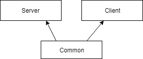
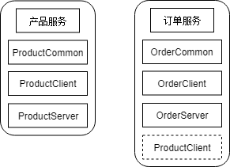

# 应用间通信

## HTTP vs RPC

Dubbo(RPC)
RPC框架，在服务间集成治理上非常完善，不仅提供了服务注册发现，负载均衡和路由等面向分布式集成的基础能力，还设计了面向开发测试阶段的mock，同时提供监控和可视平台
SpringCloud(HTTP)
微服务架构下的一战式解决方案。

### SpringCloud中服务间两种restful调用方式

+ RestTemplate
+ Feign

#### RestTemplate

RestTemplate有3中方式

1. 直接使用服务地址url方式，这个是一个初级方案
2. 使用`org.springframework.cloud.client.loadbalancer.LoadBalancerClient`实现获取指定服务的ServiceInstance对象。由这个对象获取调用服务的机器名和端口号
3. 使用@LoadBalanced注解，加在使用java配置Bean的时候，后续通过spring容器构造的RestTemplate(Autowired)会具有负载均衡的能力

```java
@Bean
@LoadBalanced
public RestTemplate restTemplate(){
    RestTemplate rest = new RestTemplate();
    return rest;
}
```

```java
restTemplate.getForObject(new URI("http://PRODUCT/product/getProductInfo"), String.class);
```

注意PRODUCT只是一个微服务的名称，springcloud会自动查询微服务对应的信息，但是又不暴露在外面并且又负载均衡的作用

#### 客户端负载均衡器 Ribbon

注册中心分为服务端发现和客户端发现。Eurak是客户端的实现方式，它的负载均衡是软负载，客户端像服务器拉取服务端已注册的服务信息，然后根据负载均衡策略，直接发送请求，整个过程都是在客户端完成的，并不需要服务端的参与。
SpringCloud的客户端负载均衡就是Ribbon组件，它是基于Netflix Ribbon实现，通过封装使用RestTemplate请求自动调用。Http实现使用了HttpClient和Okhttp两种Http库

Ribbon实现软负载均衡核心3点：

+ 服务发现:发现依赖服务的列表，根据服务的名称将服务下找出所有服务实例
+ 服务选择规则:从多个服务中选择一个有效的服务
+ 服务监听：检测失效的服务

主要组件：

+ ServerList
+ IRule
+ ServerListFilter

通过ServerList获取可用的服务列表，然后通过ServerListFilter过滤掉一部分地址，IRule从剩下的地址中选择一个实例作为最终地址

配置IRule实现

```yml
PRODUCT:
  ribbon:
    NFLoadBalancerRuleClassName: com.netflix.loadbalancer.RandomRule
```

将规则配置成了随机访问，PRODUCT是服务的名称，这个是区分大小写的。如果写错了就不生效

#### Feign的使用

1. 添加依赖,以前的feign作废了，使用openfeign

```xml
<dependency>
    <groupId>org.springframework.cloud</groupId>
    <artifactId>spring-cloud-starter-openfeign</artifactId>
</dependency>
```

2. 在启动类添加注解@EnableFeignClients
3. 定义接口,添加FeignClient注解，name表示产品服务的名称，定义要访问url接口，这里@GetMapping表示访问url使用GET方式，注解的中可以指定服务的url，这里不能错

```java
@FeignClient(name="PRODUCT")
public interface ProductClient {
    @GetMapping("/product/getProductInfo")
    String getProductInfo();
}
```

使用Feign注意访问方式要和服务端一致，最注意的是url要是`服务端控制器定义的完整地址`。

#### 项目多模块改造

目前的微服务之间有几个缺点:

+ 直接将数据表对应的实体对象返回，要单独定义对应的bean
+ 项目中使用了别的服务使用定义的url，应该由服务提供方提供client模块
+ 集成服务定义Bean在每个项目都要定义一次。应该整合到服务提供方的client模块中
+ 微服务没有模块化，使用Maven的模块功能

通用模块介绍：

+ Server模块:所有业务逻辑代码，控制层，服务层
+ Client模块:对外暴露的接口
+ Common模块:公用的对象

Server和Client都依赖Common模块:


模块重新划分：

订单模块由于依赖产品模块的集成服务，所将产品的Client模块引入，用于调用调用产品模块的服务