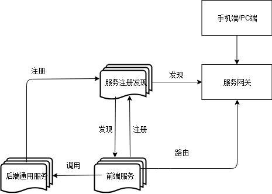

# 微服务简介

## 微服务的提出

James Lewis和Martin Fowler在2014年3月25日提出，微服务是架构风格，所以它没有强制性和绝对标准的答案。

## 微服务的特点

+ 一系列微小的服务组成
+ 跑在自己进程里
+ 每个服务为独立的业务开发
+ 独立部署
+ 分布式的管理

## 单体架构的优缺点

优点很少，缺点比较多了

优点:
容器测试，容器部署
缺点:
开发效率低,代码维护难,部署不灵活（构件时间长),稳定性不高,扩展性不够(IO不平衡)

### 分布式定义

在支持应用程序和服务的开发，可以利用物理架构，由多个自治的处理元素，不共享主内存，但通过网络发送消息合作

分布式系统和集群有什么差别
厨房里面有两个厨师，一个洗菜一个炒菜就叫分布式，互不干扰，如果两个都炒菜就是集群。

### 简单的微服务架构图

#### 微服务架构的基础框架/组件

+ 服务注册发现
+ 服务网关(Service Gateway)
  + 对外屏蔽服务细节
  + 将外部请求路由到内部某个服务
  + 限流和容错功能
  + 监控和日志
  + 认证和权限
+ 后端通用服务(Middle Tier Service)
+ 前端服务(边缘服务EdgeService)

后端服务间信息注册到服务注册表中。前端通过查询注册表就可以调用后端服务。前端服务主要是将后端服务进行聚合和裁剪暴露给外部

### Spring Cloud是什么

SpringCloud一个开发工具集，有多个子项目

+ 利用SpringBoot的开发便利
+ 利用Netflix开源组件的进一步封装
+ 简化了分布式开发的门槛

