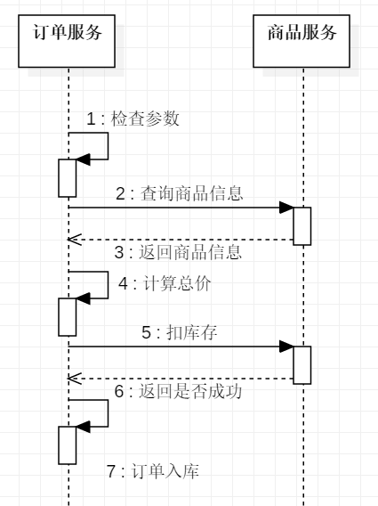

# 服务拆分

## 康威定律和微服务

康威定律:任何组织在设计一套系统时，所交付的设计方案在结构上都与该组织的沟通结果保持一致。
设计系统时要和当时的团队技术栈结合，启点和终点不能订脱离实际。

### 服务拆分的方法论

扩展立方模型(Scale Cube)
X轴 水平复制(通过副本扩展将应用水平复制，实现伸缩性和容量可用度)
Z轴 数据分区(每个服务器负责一个数据子集，但是代码都是相同的)
Y轴 功能解耦(按照职责将功能不同的模块)

### 如何拆分功能

+ 单一职责，松耦合，高内聚
+ 关注点分离(按职责分类，按通用性-基础组件，按颗粒度)

### 服务和数据的关系

+ 先考虑业务功能，再考虑数据
+ 无状态服务(如果一个数据可以被多服务共享才能完成一个请求就叫无状态数据)，理想将有状态的服务改成无状态的服务

## API和SQL介绍

参考API和spell文档

## 商品服务编码

1. 创建product的工程，依赖的模块是Web和EurekaDiscover
2. 创建控制器和数据库链接，依赖的模块是spring-boot-jpa和mysql驱动,下面是依赖配置

```xml
<dependency>
    <groupId>org.springframework.boot</groupId>
    <artifactId>spring-boot-starter-data-jpa</artifactId>
</dependency>
<dependency>
    <groupId>mysql</groupId>
    <artifactId>mysql-connector-java</artifactId>
    <version>8.0.13</version><!--$NO-MVN-MAN-VER$-->
</dependency>
```

3. 数据库链接配置

```yml
spring:
  datasource:
    driver-class-name: com.mysql.cj.jdbc.Driver
    username: root
    password: wtadmin
    url: jdbc:mysql://localhost:3306/springcloud_spell?characterEncoding=utf-8&userSSL=false&serverTimezone=Hongkong
```

4. 创建实体Bean，

这里要使用一个开发工具lombok可以简化开发，可以用注解生成set/get方法等等
lombok是通过在编译器添加agent操作字节码的,有3个地方需要配置：POM.xml,Eclipse,Maven都需要添加对lombok的依赖。

+ POM.xml的配置

```xml
<dependency>
    <groupId>org.projectlombok</groupId>
    <artifactId>lombok</artifactId>
    <version>1.18.4</version><!--$NO-MVN-MAN-VER$-->
    <scope>provided</scope>
</dependency>
```

+ Eclipse就比较简单，在POM.xml配置完成后会自动下载jar包，双击jar会有GUI界面弹出来，然后指定eclipse的安装目录就可以了
+ Maven安装lombok的插件，配置如下:

```xml
<plugin>
    <groupId>org.projectlombok</groupId>
    <artifactId>lombok-maven-plugin</artifactId>
    <version>1.16.8.0</version>
    <executions>
        <execution>
            <phase>generate-sources</phase>
            <goals>
                <goal>delombok</goal>
            </goals>
        </execution>
    </executions>
</plugin>
```

5. 创建Repository接口，使用Jpa可以方面查出数据，注意接口的方法有一定的规范，可以参考[SpringJPA文档](https://docs.spring.io/spring-data/data-jpa/docs/current/reference/html/#repositories.query-methods.details).

```java
public interface ProductInfoRepository extends JpaRepository<ProductInfo, String>{
   public List<ProductInfo> findByProductStatus(Integer productStatus);
}
```

## 订单部分

### 创建订单

订单相关API和参数参考API.md文档，这里主要记录下开发时的异常，交互逻辑如下：


1. 在保存OrderMaster对象到数据库时提示createTime为空，看了下别人的提问不止我一人。有一个靠谱的回答就是加入@DynamicInsert和@DynamicUpdate两个注解。这个两个注解时为了提升sql更新和插入的性能，如果对于javaBean为空的字段就不更新，这样就会触发这个表的默认值。问题是视频里里面是没有这两个注解的，可能和视频是一年前录制有关系。