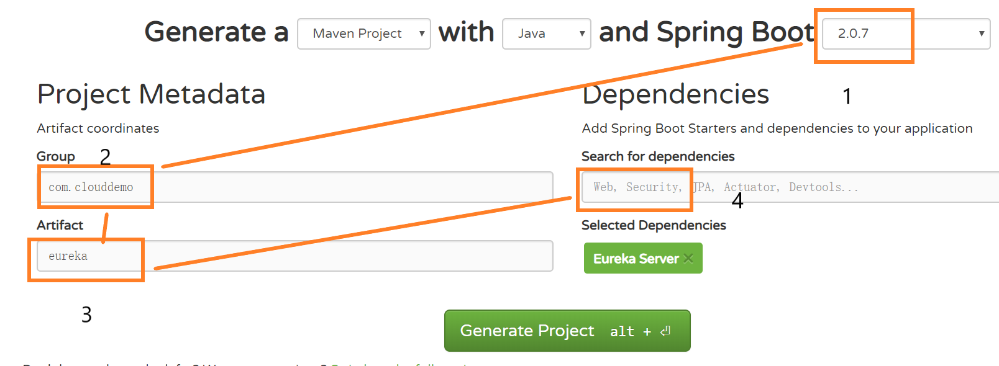
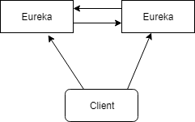
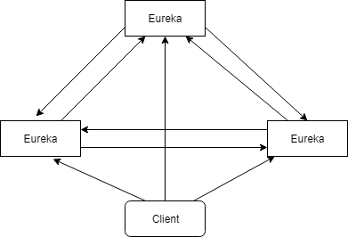

# Eureka

Spring Eureka基于Netflix Eureka做二次封装，由服务端和客户端组成。客户端用来简化与服务端的交互，作为轮询负载均衡器提供了服务故障的切换。服务端是服务注册中心

## 注册中心(Eureka Server)

注册中心提供服务的注册和发现。

### 创建Eureka服务端项目

+ 使用[Spring官网的构件工具](https://start.spring.io/),创建EurekaServer的Maven项目。按照下图输入，然后再点击GenerateProject就可以生成好了

+ 网站默认生成了一些代码，这个启动是有问题，需要加上```@EnableEurekaServer```才能启动eureka，启动后Eureka默认会找服务端，在日志还是会有些报错。打开[Eureka](http://127.0.0.1:8761/)页面显示注册相关信息

```java
@SpringBootApplication
@EnableEurekaServer
public class EurekaApplication {
    public static void main(String[] args) {
        SpringApplication.run(EurekaApplication.class, args);
    }
}
```

+ 使用yml的配置文件，eclipse需要按照插件才可以编辑，这里安装的是YEdit

```yml
spring:
  application:
    name: eureka
server:
  port: 8761
eureka:
  client:
    service-url:
      defaultZone: http://127.0.0.1:8761/eureka
    register-with-eureka: false
```

将yml翻转成properties

|属性|描述|
|-|-|
|spring.application.name|应用名称，在eureka页面上显示服务的名称|
|server.port|http的端口号
|eureka.client.service-url.defaultZone|eureka注册地址
|eureka.client.register-with-eureka|eureka服务端不注册自己

## Eureka客户端

1. 从spring官网上生成maven的模板.这里有点要注意的Search for dependencies要填写Web和EurekaDiscovery。如果填写EurekaDiscovery会导致Springboot启动后就关闭了。
2. 启动代码,需要添加@EnableDiscoveryClient,有人问了为什么不是@EableEurekaClient。由于EableEurekaClient只能用于Eureka注册中心，EnableDiscoveryClient可以适配多种注册中心。

```java
@SpringBootApplication
@EnableDiscoveryClient
public class ClientApplication {
    public static void main(String[] args) {
        SpringApplication.run(ClientApplication.class, args);
    }
}
```

3. eureka相关配置

eureka.instance.hostname表示注册到服务器的域名，可以在eureka配置页面点击主机时跳转响应的页面

## Eureka高可用

启动多个Eureka实例，并且相互注册，多个实例会将注册信息共享，来达到高可用的目的。客户端只需要将所有的注册服务地址配置后即可。

+ 两台Eureka实例相互注册



+ 三台或者多台相互注册



服务端配置要求：

1. Eureka实例的端口号不能相同
2. 修改eureka.client.service-url.defaultZone属性,它的值时其他eureka服务的地址，并且用逗号分割

```properties
eureka.client.service-url.defaultZone=http://127.0.0.1:8761/eureka,http://127.0.0.1:8762/eureka
```

客户端配置要求

1.客户端配置需要添加所有Eureka服务器注册地址

```properties
eureka.client.service-url.defaultZone=http://127.0.0.1:8761/eureka,http://127.0.0.1:8762/eureka,http://127.0.0.1:8762/eureka
```

## 分布式系统中为什么需要服务发现

1. 注册中心是基础设施的中心，必须是高可用的。
2. 服务发现是为了解决模块节点过多导致，调用复杂，所以当模块启动后大家都会像注册中心去注册自己的信息，调用者只需要向注册中心查询就可以得到调用的地址。
3. 服务发现分为服务发现和客户端发现。
   + 客户端发现是客户端直接向注册中心查询，注册中心将查询结果全部返回给客户端，客户端只用从查询结果中挑选一个调用
   + 服务端发现引入了代理的概念，客户端向代理发起请求，代理帮助客户端查询，并在结果中挑选一个返回客户端。

|客户端发现|服务端发现|
|---------|---------|
|Eureka|Nginx|
||Zookeeper|
||Kubernetes|
